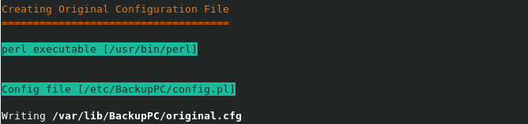
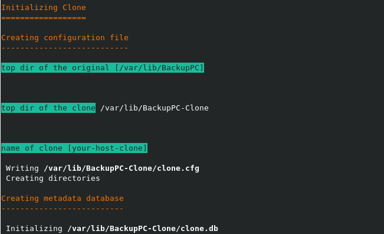
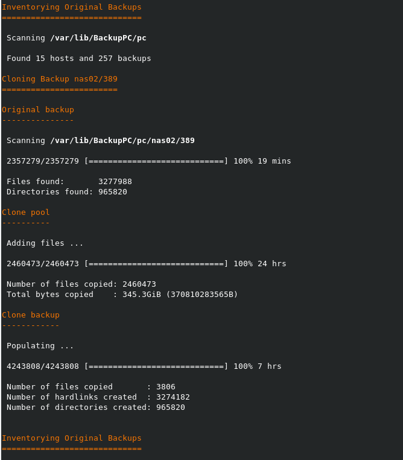

.. _getting-started:

Getting Started
===============

In this chapter we discuss all steps for installing, configuring, and running BackupPC-Clone.

In this chapter we assume that the data directory of BackupPC is ``/var/lib/BackupPC`` and the data directory of
BackupPC-Clone is ``/var/lib/BackupPC-Clone`` and BackupPC is running under user ``backuppc``.

The commands in section :ref:`installing` must be executed under ``root`` and all other commands under user ``backuppc``.

.. _installing:

Installing BackupPC-Clone
-------------------------

BackupPC-Clone can be installed using ``pip``:

.. code-block:: sh

  pip3 install BackupPC-Clone

Create the data directory of BackupPC-Clone:

.. code-block:: sh

  mkdir /var/lib/BackupPC-Clone
  chown backuppc.backuppc /var/lib/BackupPC-Clone

Configuring BackupPC-Clone
--------------------------

BackupPC-Clone requires configuration files in the data directory of BackupPC and in the data directory of
BackupPC-Clone.

Create the configuration file of the “original” using the ``init-original`` command and provide the answers according to
the configuration of your BackupPC host:

.. code-block:: sh

  backuppc-clone init-original

The output will look like:

The created configuration file looks like:

.. code-block:: ini

    [BackupPC Clone]
    role = original
    name = your-host

    [Original]
    top_dir = /var/lib/BackupPC
    conf_dir = /etc/BackupPC
    log_dir = /var/log/backuppc
    pc_dir = /var/lib/BackupPC/pc

Create the configuration file of the “clone” using the ``init-clone`` command and provide the answers according to
the configuration of your BackupPC host:

.. code-block:: sh

  backuppc-clone init-clone

The created configuration file looks like:

.. code-block:: ini

    [BackupPC Clone]
    role = clone
    name = your-host-clone

    [Original]
    config = /var/lib/BackupPC/original.cfg
    name = your-host

If you are planning to create multiple clones use distinct names for the clones.

Cloning BackupPC
----------------

To create a complete clone of the data directory of BackupPC use the ``auto`` command:

.. code-block:: sh

  nohup backuppc-clone --ansi auto -v /var/lib/BackupPC-Clone/clone/clone.cfg > auto.log  2>&1 &

The first part (the output will be repeated for each backup) of the output will look like (using a slow external hard
disk):

Depending on the size and number of files in data directory of BackupPC and the speed of your hardware this command will
take some time to complete.
